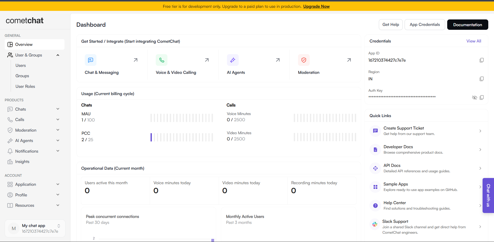
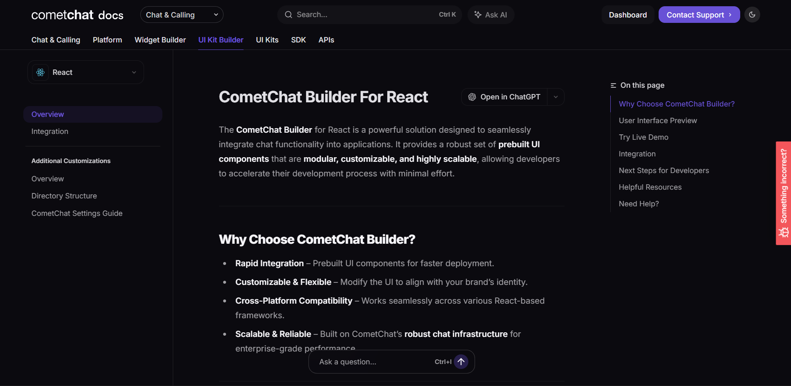
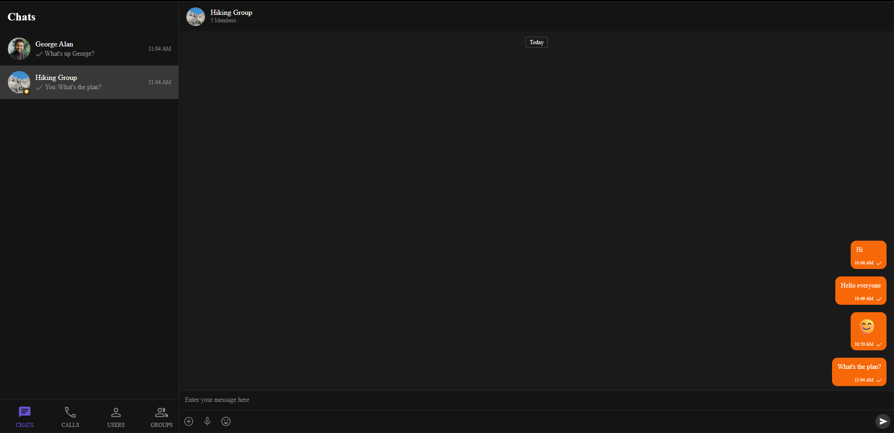

# CometChat Internship Assignment – React UI Kit Implementation

This repository contains my submission for the CometChat Frontend (React) Internship Assignment.  
The project includes:

- Implementation of the CometChat React UI Kit  
- Screenshots & a short video recording of the setup and working UI  
- A detailed PDF report documenting issues, observations, and improvement suggestions across:
  - Dashboard
  - UI Kit Builder
  - Documentation
  - UI Kit Implementation

---

## 🚀 Project Overview

The goal of this assignment was to:

1. Create an account on CometChat using a **+test Gmail address**
2. Navigate and explore the CometChat Dashboard
3. Configure and download a **React UI Kit**
4. Implement and run the UI Kit locally
5. Identify issues, confusion points, bugs, and improvement opportunities across:
   - Dashboard
   - UI Kit Builder
   - Documentation
   - Implementation experience
6. Document all findings in a structured professional report

This repository contains all required implementation files and visual evidence of the working UI.

---

## 📁 Repository Structure

```
├── cometchat-demo/               # React project with the UI Kit integrated
├── screenshots/                  # Screenshots used in README & PDF report
├── video/                        # Short screen recording of the working project
├── report/                       # PDF report with detailed issues & suggestions
└── README.md                     # This file
```

---

## 🛠️ Tech Stack

- **React (Vite)**
- **Node.js & npm**
- **CometChat UI Kit for React**
- **JavaScript / JSX**

---

## ▶️ How to Run the Project Locally

Follow these steps:

### **1. Clone the repository**
```bash
git clone https://github.com/<your-username>/<your-repo-name>.git
cd <your-repo-name>/cometchat-demo
```

### **2. Install dependencies**
```bash
npm install
```

### **3. Start the development server**
```bash
npm run dev
```

### **4. Open your browser**
Go to:  
```
http://localhost:5173
```

You should now see the CometChat UI Kit running in your browser.

---

## 📸 Screenshots

Below are some key screenshots of the working UI:

| UI Region | Screenshot |
|----------|------------|
| Dashboard |  |
| UI Kit Builder |  |
| Running React UI Kit |  |

---

## 🎥 Screen Recording

A short video of launched app using UI Kit Builder:

Video file is available here:  
```
./public/running-app.mp4
```

---

## 🔍 Key Learning & Experience

During this assignment, I learned:

- How CometChat's UI Kit works and how to integrate it  
- How to identify UX/UI issues and document them professionally   
- Troubleshooting installation/integration issues  
- Writing structured reports with screenshots  

---

## 👤 Author

**Nandni Atray**  
Frontend Developer  
Email: thelearner049@gmail.com    

---

## ⭐ Thank You!

Thanks to the CometChat team for providing this assignment — it was a great learning experience exploring the product and developer tools.
